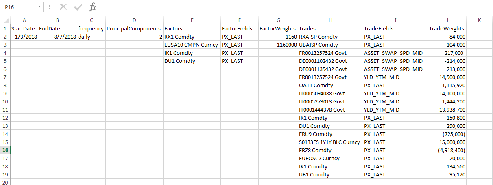

# Walkthrough of `find_Beta.R`

## Table of Contents


-  [Background](#background)
   - [Why R?](#why-r)
   - [R Mimics the Mathematical Thought Process](#r-mimics-the-mathematical-thought-process)
   - [R vs. Excel](#r-vs-excel)
-  [Installation](#installation)
   - [Install R](#install-r)
   - [Install RStudio](#install-rstudio)
-  [Program Overview](#program-overview)
    - [Input](#input)
    - [findBeta](#findbeta)
       - [Formatting R Environment](#formatting-r-environment)
       - [Input Data](#input-data)
       - [Library Import](#library-import)
       - [Initialization](#initialization)
       - [Functions](#functions)
       - [Analysis](#analysis)

  
  

# Background

## Why R?

R is a free software environment for statistical computing and graphics. R is a dialect of the S language, which is now rarely used due to R's popularity and simplicity. S started as a research project at Bell Labs a few decades ago, originally developed for in-depth data analysis, statistical modeling, simulation, and graphics design.

As researchers and mathemeticians developed incrasingly complex algorithms, developers had a difficult time implementing them. As a result, R was born, allowing high-level mathematics to be implemented efficiently. Statisticians soon followed, abandoning their academic but antiquated STATA for the simplicity of R.

R was purposefully designed to make data analysis and statistics easier for you to do. It was not designed to make life easier for your computer; many modern languages are more efficient in handling loops and massive data sets, but the learning curve for these languages is much steeper. R masterfully handles matrix operations, and implementable GUIs make navigating datasets extremely simple.

  
  
  

## R Mimics the Mathematical Thought Process

Some may disagree with the above header, but they would be incorrect. Consider a simple linear regression which attempts to form a relationship for intelligence. One may argue that intelligence is dependent on genetics, education, and work ethic. The R formula to express this is as follows:

    intelligence ~ genetics + education + work_ethic

R reads the above as *"intelligence is dependent on genetics and education and work ethic,"* similarly to how you said it in your head. The language is full of these simple implementations, which makes it incredibly easy to understand.

  

## R vs. Excel

It is often argued that most complex analysis should be completed in an external environment. An enlightening article, [Spreadsheet Addiction](https://www.burns-stat.com/documents/tutorials/spreadsheet-addiction/), explains the *many* pitfalls of relying on massive interconnected spreadsheets. Your in-house IT guy knows the dangers of spreadsheet abuse; this is why all of your important data is housed in a database, not in one large Excel document.

Spreadsheet formulas are vague, have poor documentation, and are notoriously computationally expensive. For example, in Excel, the function `=AVERAGE()` requires the user to both manually input the range desired, and can easily be broken if incorrect inputs are found in the range. Additionally, if one were to add data to the end of the range without updating the range in the formula, you will *never know* that your computation is completely incorrect. R's `mean()`, in addition to being faster, is able to handle exceptions, and does not require the user to define a range, only a dataset to be averaged.

If you take the few short hours it takes to learn the language, you may soon see that your current method of data analysis is probably inefficient.

  
  
  

# Installation

## Install R

1) Navigate to [R Project](https://www.r-project.org/), the official home for all things R related. Here you can download the computing language R and navigate CRAN, to be explained later.

2) Click on the "[Download R](https://cran.r-project.org/mirrors.html)" link. This should take you to the CRAN Mirrors repository.

3) Navigate to your country, likely the United States. I prefer [UC Berkley's R implementation](https://cran.cnr.berkeley.edu/) for absolutely no official reason.

4) Navigate to the desired download link at the top of the page. If you are running a Windows machine, [click on the Windows link](https://cran.cnr.berkeley.edu/bin/windows/).

5) As this is likely your first time installing R, click on "[install R for the first time](https://cran.cnr.berkeley.edu/bin/windows/base/)."

6) At the top of the page, click on the bolded and enlarged "[Download R \*\*.\*\*.\*\* for Windows](https://cran.cnr.berkeley.edu/bin/windows/base/R-3.5.1-win.exe)." This should download an executable `.exe` file to your **Downloads** folder.

7) Open the `.exe` file, and click through the installation. In the **"Select Components"** window, make sure all of the options are checked to be downloaded. In the **"Select Additinoal Tasks"** window, make sure to select the **"Save version number in registry."** Run the installer to completion, and the R language will be saved on your machine.


## Install RStudio

You are not yet ready to run operations in R. First, you need some software to allow you to interact with the language your computer now understands. The favorite among R programmers is called **RStudio**. It is simple to understand, and has a surprising number of features, if you are interested in learning.

1) Navigate to [RStudio's Homepage](https://www.rstudio.com/).

2) Find the "[Download RStudio](https://www.rstudio.com/products/rstudio/download/)" button on the front page.

3) Click on the "Download" button below the "[RStudio Desktop](https://www.rstudio.com/products/rstudio/download/#download)" header. This should be advertised as **"FREE"**. If it is not, we are gonna have some big problems.

4) Click on the appropriate link under **"Installers for Supported Platforms"**, corresponding to your machine. If you have Windows, click on the **"Windows Vista/7/8/10"** option. This should download a `.exe` file.

5) Open the `.exe` executable in your **Downloads** folder. Navigate your way through the simple installation process. Make sure to check everything you can, to make sure you are downloading all necessary files. Also, create a desktop icon if you are inclined to use your mouse to navigate on your computer.

6) Open up your newly-downloaded RStudio program. At the bottom of the window, you should see a sub-window marked **"Console"**. Where you see the `>` symbol, type the following code (with or without spaces):


       2 + 2

   Hit **"Enter"**. If the machine returns `4` as your answer, you are ready to begin!

  
  
  
  

# Program Overview

For the `findBeta` program, you will only need two files. The first is an Excel file, which acts as input. The second is the R file, which acts on the input. The output file will be created after the program is run.


## Input

The input file is fairly straightforward. It can be saved under different document names, as the file name is an input in the analysis program. This allows for various input portfolios to be saved at once, increasing flexibility of analysis.

The input file is Excel-based and should look like the following:



The first two columns, `StartDate` and `EndDate` are fairly straightforward.  The columns allow the user to specify the time range for the analysis.

`Frequency` can be changed to `daily`, `weekly`, or `monthly`, though the user should generally stick to daily granularity.

`PrincipalComponents` specifies the number of principal components to use in the Principal Components Regression (PCR).  Sometimes using fewer principal components than the number of factors can yield positive results in terms of predictive ability by removing some "noise" often found in financial time series.

`Factors`, `FactorFields`, and `FactorWeights` are used as input fields for the "factors" you wish to analyze.  `Factors` requires an input corresponding to a Bloomberg security, allowing the program to pull from Bloomberg's history.  `FactorFields` corresponds to a Bloomberg field for the given security, which can be found using the `FLDS <GO>` command in Bloomberg terminal.  `FactorWeights` corresponds to a weighting for each of the factors, which can be used to normalize input, to an extent.  For example, if a security is listed in Bloomberg in terms of yield %, one may want to convert to yield bps by adding `100` in the weight field.  Similarly, the user may account for indices quoted in terms of some notional value, or convert between currencies.

`Trades`,  `TradeFields`, and `TradeWeights` can be used in the same way as the factor inputs.  The `TradeWeights` should also take into account portfolio holdings; for example, if a user is holding 50 contracts of a security `ABC`, `TradeWeights` should be updated accordingly so the entire portfolio performance can be assessed.

After all fields are filled, save the file before running the analysis program.


## findBeta

The `findBeta.R` program does the heavy-lifting once inputs are properly formatted.  The program should be opened from the File Explorer so the filepath is correct in RStudio.

The function is broken into several subsections, each of which will be described in detail.

### Formatting R Environment

```R
#### FORMATTING R ENVIRONMENT ####
cat("\014")
rm(list=ls())
graphics.off()
```


The code formats your R environment nicely before running.  

`cat("\014")` clears the console before running any new code.

`rm(list=ls())` removes all old objects from the Global Environment, leaving the user with a clean workspace.

`graphics.off()` clears all charts from the "Plot" window, freeing up memory and removing old charts which may be confusing.

This code can be useful for *all* R sessions, not just this one.  If the user does not want old data to be cleared, this section can be commented by prefacing each line with `#` characters.


### Input Data

```R
#### INPUT DATA ####
input.filename <- "input_test.xlsx"
output.filename <- "out_test.xlsx"
```

This section allows the user to specify the "input" and "output" filenames for this analysis.  The "input" filename should correspond to the input Excel file created in the last section.  The "output" filename can be anything the user desires.  Both files are stored in the same directory as `findBeta.R`.

### Library Import

```R
#### LIBRARY IMPORT ####
## Data manipulation ##
if (!require(stringr)) install.packages('stringr'); library(stringr)
if (!require(lubridate)) install.packages('lubridate'); library(lubridate)
if (!require(qcc)) install.packages('qcc'); library(qcc)
if (!require(dplyr)) install.packages('dplyr'); library(dplyr)
if (!require(xts)) install.packages('xts'); library(xts)
if (!require(zoo)) install.packages('zoo'); library(zoo)
if (!require(timeDate)) install.packages('timeDate'); library(timeDate)
if (!require(bizdays)) install.packages('bizdays'); library(bizdays)
if (!require(data.table)) install.packages('data.table'); library(data.table)
if (!require(quantmod)) install.packages('quantmod'); library(quantmod)
if (!require(readxl)) install.packages('readxl'); library(readxl)
if (!require(readr)) install.packages('readr'); library(readr)
if (!require(rlist)) install.packages('rlist'); library(rlist)
if (!require(stats)) install.packages('stats'); library(stats)
if (!require(sqldf)) install.packages('sqldf'); library(sqldf)
if (!require(openxlsx)) install.packages('openxlsx'); library(openxlsx)

## Data Visualization ##
if (!require(ggplot2)) install.packages('ggplot2'); library(ggplot2)
if (!require(ggfortify)) install.packages('ggfortify'); library(ggfortify)
if (!require(GGally)) install.packages('GGally'); library(GGally)
if (!require(corrplot)) install.packages('corrplot'); library(corrplot)
if (!require(gganimate)) install.packages('gganimate'); library(gganimate)
if (!require(animation)) install.packages('animation'); library(animation)
if (!require(magick)) install.packages('magick'); library(magick)
if (!require(mosaic)) install.packages('mosaic'); library(mosaic)
if (!require(plotrix)) install.packages('plotrix'); library(plotrix)
if (!require(shape)) install.packages('shape'); library(shape)

## Modeling / Forecasting ##
if (!require(randomForest)) install.packages('randomForest'); library(randomForest)
if (!require(glmnet)) install.packages('glmnet'); library(glmnet)
if (!require(forecast)) install.packages('forecast'); library(forecast)
if (!require(prophet)) install.packages('prophet'); library(prophet)
if (!require(psych)) install.packages('psych'); library(psych)
if (!require(nFactors)) install.packages('nFactors'); library(nFactors)
if (!require(GPArotation)) install.packages('GPArotation'); library(GPArotation)
if (!require(kernlab)) install.packages('kernlab'); library(kernlab)
if (!require(usdm)) install.packages('usdm'); library(usdm)
if (!require(FactoMineR)) install.packages('FactoMineR'); library(FactoMineR)
if (!require(factoextra)) install.packages('factoextra'); library(factoextra)
if (!require(fAssets)) install.packages('fAssets'); library(fAssets)
if (!require(cluster)) install.packages('cluster'); library(cluster)
if (!require(fpc)) install.packages('fpc'); library(fpc)
if (!require(ClustOfVar)) install.packages('ClustOfVar'); library(ClustOfVar)
if (!require(Hmisc)) install.packages('Hmisc'); library(Hmisc)
if (!require(mclust)) install.packages('mclust'); library(mclust)
if (!require(pls)) install.packages('pls'); library(pls)
if (!require(ridge)) install.packages('ridge'); library(ridge)

## Interaction with Bloomberg ##
if (!require(Rblpapi)) install.packages('Rblpapi'); library(Rblpapi)
blpConnect()
```

This section imports important libraries of functions found in the local R library.  If the user do not have the libraries installed, the lines of code will install them from R's CRAN.  The somewhat confusing structure of each line is so that initial downloads are initiated if the libraries do not exist in the host's local library repository.


### Initialization

This section pulls data from the input file and reformats the data to be used in R.  Each section is described below.

```R
## Pull input data ##
input_data <- read.xlsx(input.filename, detectDates = TRUE)
## Start and end date ##
date.start <- input_data$StartDate[1]
date.end <- input_data$EndDate[1]
```
Input data is pulled from the input file specified in the Input section.  The `.xlsx` document is reformatted to a dataframe, the data structure used by R.  Start and end dates used in the analysis are parsed from the columns of the input.

```R
## Get security names and trades names to pull from Bloomberg ##
# factors
factors <- c(input_data$FactorWeights)
names(factors) <- input_data$Factors
factors <- factors[!is.na(factors)]
factors.fields <- input_data$FactorFields
factors.fields <- factors.fields[!is.na(factors.fields)]
#trades
trades <- as.matrix(input_data$TradeWeights)
names(trades) <- input_data$Trades
trades <- trades[!is.na(trades)]
trades.fields <- input_data$TradeFields
trades.fields <- trades.fields[!is.na(trades.fields)]
frq <- input_data$frequency
frq <- frq[!is.na(frq)]
```
Factors and securities inputs are separated and saved as individual objects.  Since the lengths of input factors and the portfolio of trades are generally not the same length, the process is rather manual and is done separately.  `#N/A` values are removed.

```R
## Get number of components ##
number.of.components <- input_data$PrincipalComponents
number.of.components <- number.of.components[!is.na(number.of.components)]
```
The number of principal components is parsed last, though the ordering is not significant.  This value is stored separately.


### Functions
Local functions are established to be used in the Analysis section.  Each function is described below.

```R
## Generate historical time series data ##
hist_timeseries_pull <- function(stDate, edDate, sec, sec.flds) {
  retdata <- xts()
  for (i in 1:length(sec)) {
    secobj <- sec[i]
    fld <- sec.flds[i]
    hold.dat <- get_hist_yield(stDate, edDate, secobj, fld)
    retdata <- merge.xts(retdata, hold.dat)
  }
  retdata <- diff(retdata)[-1,]
  return(retdata)
}
```
`hist_timeseries_pull()` acts as a wrapper of sorts, recurrently calling `get_hist_yield()` to pull data from Bloomberg.  Inside the function, the data is "differenced" and returned as a time series (`xts`) object.

```R
## Get historical yield of security, converted to time series ##
get_hist_yield <- function(stDate, edDate, sec, fld) {
  d <- bdh(securities=sec,
           fields = fld,
           start.date=stDate,
           end.date=edDate,
           include.non.trading.days=FALSE)
  
  test1 <- as.data.frame(d[,fld])
  names(test1) <- sec
  rownames(test1) <- d$date
  test1 <- as.xts(test1)
  return(test1)
}
```
`get_hist_yield()` acts as an interactor between Bloomberg databases and the R environment.  It takes in `stDate` and `edDate` as a date range, `sec` as the security name (Bloomberg ticker) from which to pull, and `fld` describing which fields to pull from the Bloomberg history.  Data is then converted to a time series (`xts`) object, and is returned.


```R
## Generate historical time series data (yield) ##
hist_yield_pull <- function(stDate, edDate, sec, sec.flds) {
  retdata <- xts()
  for (i in 1:length(sec)) {
    secobj <- sec[i]
    fd <- sec.flds[i]
    hold.dat <- get_hist_yield(stDate, edDate, secobj, fd)
    retdata <- merge.xts(retdata, hold.dat)
  }
  
  return(retdata)
}
```
`hist_yield_pull()` is an alternative to `get_hist_yield()` used in a similar manner.


```R
## Checks for the number of N/A values in each dataset ##
check_for_NA <- function(ts.data) {
  a <- c()
  for(i in 1:ncol(ts.data)) {
    a[i] <- sum(is.na(ts.data[,i]))
  }
  a <- as.data.frame(a)
  rownames(a) <- colnames(ts.data)
  colnames(a) <- c("Number of N/A")
  return(a)
}
```
`check_for_NA()` does exactly what it should.  It checks for the number of `#N/A` values of a Bloomberg-pulled `xts` object, and returns a list of the number of `#N/A` values for each security.  `#N/A`s can arise for a number of reasons, including nonexistent data if securities were recently created or missing data due to international holidays.  

```R
## Formats portfolio for analysis ##
format_port <- function(tstdt, tstpt, wgts, secwgts) {
  # do weighting and rowsums for portfolio
  portf <- tstpt
  for (i in 1:length(wgts)) {
    portf[,i] <- tstpt[,i] * wgts[i]
  }
  portfolio <- .xts(rowSums(portf), .index(portf))
  # do weighting for factors
  factf <- tstdt
  for (j in 1:length(secwgts)) {
    factf[,j] <- tstdt[,j] * secwgts[j]
  }
  # merge weighted timeseries objects
  fullport <- merge.xts(portfolio, factf)
  fullport <- na.locf(na.locf(fullport), fromLast=TRUE)
  return(fullport)
}
```
`format_port()` formats the portfolio of factors and trades based on their corresponding weights.  

```R
format_trade <- function(td, wd, tp, wp) {
  # weight trade
  trade.single <- tp*wp
  colnames(trade.single) <- "trade.name"
  
  
  # weight portfolio
  factf <- td
  for (j in 1:length(wd)) {
    factf[,j] <- td[,j] * wd[j]
  }
  
  # merge trade with factors
  newport <- merge.xts(trade.single, factf)
  
  # fill in #N/A with previous day data
  newport <- na.locf(na.locf(newport), fromLast=TRUE)
  newport <- newport[-1,]
  return(newport)
}
```
`format_trade()` is used in analysis similarly to `format_port()`, but instead of formatting the entire portfolio, only one single trade is formatted.  This allows for a more granular analysis.


### Analysis
The analysis is included within a wrapper function, which allows for easy running of the program.  The function, `run_findBeta()`, can be run and the analysis is all done internally.  Each section within `run_findBeta()` is broken down below:

```R
  ## Setup ##
  # initialization message
  cat("\n", "Connection established: Retrieving Bloomberg data...", "\n"); cat("\n")
  # pull out names and weights
  port.weights <- trades
  port <- names(trades)
  securities.weights <- factors
  securities <- names(factors)
```
This section does basic setup within the wrapper for clearer labeling.

```R
  # generate time series of factors
  testdat <- hist_timeseries_pull(date.start, date.end, securities, factors.fields)
  # generate time series of portfolio of trades
  testport <- hist_yield_pull(date.start, date.end, port, trades.fields)
  # check for missing data in trades history
  testport.na <- check_for_NA(testport)
  if (max(testport.na) >= 0.3*nrow(testport)) {
    warning("Check historical trade data. One or more trades missing significant data:", 
            immediate.=TRUE)
    holdind <- rownames(testport.na)[which(testport.na >= 0.3*nrow(testport))]
    for (i in 1:length(holdind)) {
      cat(holdind[i], "\n")
    }
    cat("\n"); cat("\n"); cat("\n")
  }
```
Time time series of factors and trades are created using the previously defined functions.  `#N/A` values are checked for, and a warning message is returned if a large portion of one or more securities is composed of `#N/A` values.

For example, if we are analyzing the time period 2012-2017, and one of our securities is a bond first issued in 2016, all of the inputs from 2012-2015 will be `#N/A` values.  This could throw off our analysis, as we will fill in `0`s for these preceding `#N/A` values later in the analysis.  We may want to consider either altering our period of analysis or removing that security from the analysis provided it does not account for most of the variance in the portfolio.

```R
  # clean testport
  testport <- na.locf(na.locf(testport), fromLast = TRUE)
  testport <- diff(testport)[-1,]
  
  # throw error if trade/factor names are incorrect
  if (length(port) != ncol(testport)) {
    stop("Check 'Trades' input in CSV file.  Trade name or weight is incorrect and is not being pulled from Bloomberg.")
  } else if (length(securities) != ncol(testdat)) {
    stop("Check 'Factors' input in CSV file.  Factor name or weight is incorrect and is not being pulled from Bloomberg.")
  } else {
    # print correlation matrix of predictors
    cat("Correlation matrix for predictors:", "\n")
    correlation.matrix <- lowerCor(testdat)
    cat("\n"); cat("\n"); cat("\n")
    cat("Factors and Trades input accepted.", "\n")
  }
  
  fullport <- format_port(testdat, testport, port.weights, securities.weights)[-1,]
  if (frq == "daily") {
    cat("Daily returns to be calculated.  Analysis proceeding...", "\n")
  } else if (frq == "weekly") {
    fullport <- apply.weekly(fullport, FUN=colSums)
    cat("Weekly returns to be Calculated.  Analysis proceeding...", "\n")
  } else if (frq == "monthly") {
    fullport <- apply.monthly(fullport, colSums)
    cat("Monthly returns to be calculated.  Analysis proceeding...", "\n")
  } else {
    stop("Check 'Frequency' input in CSV file.  Input incorrect.")  
  }
```
The portfolio is "cleaned" (properly formatted, `#N/A` values scrubbed) and differenced to reduce the effect of potentially non-stationary series.  Errors are returned if the securities are not found on Bloomberg (likely due to a user input error in the Input file).  The correlation matrix of the factors is both printed and saved as a variable.  Other errors may be printed if inputs are incorrect.

```R
## Basic Linear Regression ##
  # Linear regression on each variable.
  regular.regression.output <- NULL
  for (i in 1:length(port)) {
    # format trade portfolio
    single.trade <- format_trade(td=testdat, wd=securities.weights, tp=testport[,i], wp=port.weights[i])
    if (frq == "weekly") {
      single.trade <- apply.weekly(single.trade, colSums)
    } else if (frq == "monthly") {
      single.trade <- apply.monthly(single.trade, colSums)
    }
    # run regression
    single.reg <- lm(trade.name ~., data=single.trade)
    # save variables of interest
    reg.coef <- coef(single.reg)[-1]
    reg.rsquared <- summary(single.reg)$r.squared * 100
    reg.wt <- as.double(port.weights[i])
    reg.nm <- nrow(single.trade) - testport.na[i,]
    
    # run training/testing to get RMSEP
    range.train <- 1:round(0.8*nrow(single.trade))
    train.data <- single.trade[range.train,]
    test.data <- single.trade[-range.train,]
    fit.train1 <- lm(trade.name ~., data=train.data)
    predictions1 <- predict(fit.train1, test.data)
    fit1.ActPred <- xts(cbind(actuals=test.data$trade.name, predicteds=predictions1))
    single.rmse <- sqrt(mean((fit1.ActPred$trade.name - fit1.ActPred$predicteds)^2))
    
    # format output
    reg.out <- c("weight"=reg.wt, reg.coef, 
                 "R-Squared"=reg.rsquared, 
                 "Root Mean Squared Error of Prediction (RMSEP)" = single.rmse, 
                 "Number of Observations" = reg.nm)
    reg.out <- as.data.frame(t(reg.out))
    rownames(reg.out) <- port[i]
    regular.regression.output <- rbind(regular.regression.output, reg.out)
  }
```
Multiple linear regressions are run, one for each trade in the input file.  Information from each of the regressions (including coefficient values, $R^2$ values, and Root Mean Squared Error of Prediction) are stored in the `regular.regression.output` variable.  This variable will be printed in the output file, and requires lots of formatting to be returned in a proper format.  The function `lm()` is used for regression.  In each loop, separate regressions are run over (i) the entire portfolio, and (ii) training/test datasets to compute the RMSEP on out-of-sample values.

```R
 # Linear regression on all variables combined linearly
 full.reg <- lm(portfolio ~., data=fullport)
 full.coef <- coef(full.reg)[-1]
 full.rsquared <- summary(full.reg)$r.squared * 100
 full.wt <- 1
 full.nm <- length(fullport$portfolio)
 
 # get data for printing
 preds <- fullport$portfolio -  full.reg$residuals
 colnames(preds) <- c("FittedValues Regression")
 
 # train/test on full portfolio
 range.train <- 1:round(0.8*nrow(fullport))
 train.data <- fullport[range.train,]
 test.data <- fullport[-range.train,]
 full.train <- lm(portfolio ~., data=train.data)
 full.pred <- predict(full.train, test.data)
 fit1.ActPred <- xts(cbind(actuals=test.data$portfolio, predicteds=full.pred))
 full.rmse <- sqrt(mean((fit1.ActPred$portfolio - fit1.ActPred$predicteds)^2))
 
 # format output
 full.out <- c("weight"=full.wt, full.coef, 
               "R-Squared"=full.rsquared, 
               "Root Mean Squared Error of Prediction (RMSEP)" = full.rmse,
               "Number of Observations" = full.nm)
 full.out <- as.data.frame(t(full.out))
 rownames(full.out) <- "Full Trade Portfolio"
 regular.regression.output <- rbind(regular.regression.output, full.out)
 cat("\n"); cat("Regression analysis complete.", "\n")
```
Using the same analysis as the above code, the linear regression is run on the *entire portfolio* instead of each of the individual trades.  Due to the nature of linear regression, the sums of the coefficient values of each trade should sum to the coefficient values produced in this analysis.  Again, data is formatted and stored for reporting.

```R
## Principal Components Regression ##
  
  PC.regression.output <- NULL
  for (i in 1:length(port)) {
    # format trade portfolio
    single.trade <- format_trade(testdat, securities.weights, testport[,i], port.weights[i])
    if (frq == "weekly") {
      single.trade <- apply.weekly(single.trade, colSums)
    } else if (frq == "monthly") {
      single.trade <- apply.monthly(single.trade, colSums)
    }
    # run PC regression
    single.pcr <- pcr(trade.name ~., data=single.trade,
                      validation="LOO",
                      ncomp=number.of.components,
                      jackknife=TRUE,
                      scale=TRUE)
    
    # save variables of interest
    pc.coef <- coef(single.pcr)[,,1] / single.pcr$scale
    pc.rsquared <- 100 * drop(R2(single.pcr, estimate = "train", intercept = FALSE)$val)
    pc.rsquared <- last(pc.rsquared)
    pc.wt <- as.double(port.weights[i])
    pc.nm <- length(which(single.trade$trade.name != 0))
    
    # run training/testing to get RMSEP
    range.train <- 1:round(0.8*nrow(single.trade))
    train.data <- single.trade[range.train,]
    test.data <- single.trade[-range.train,]
    pcr.train <- pcr(trade.name ~., data=train.data,
                     validation="LOO",
                     ncomp=number.of.components,
                     scale=TRUE)
    pcr.pred <- predict(pcr.train, test.data[,-1], 
                        ncomp=number.of.components, 
                        scale=TRUE)
    
    pc.rmse <- sqrt(mean((test.data[,1] - pcr.pred[,1,1])^2))
    
    # format output
    pcr.out <- c("weight"=pc.wt, pc.coef, 
                 "R-Squared"=pc.rsquared, 
                 "Root Mean Squared Error of Prediction (RMSEP)" = pc.rmse,
                 "Number of Observations" = pc.nm)
    pcr.out <- as.data.frame(t(pcr.out))
    rownames(pcr.out) <- port[i]
    PC.regression.output <- rbind(PC.regression.output, pcr.out)
  }
  
  pcr.full <- pcr(portfolio ~., data=fullport,
                  validation="LOO",
                  ncomp=number.of.components,
                  scale=TRUE)
  
  pc.coef <- coef(pcr.full)[,,1] / pcr.full$scale
  pc.rsquared <- 100 * drop(R2(pcr.full, estimate = "train", intercept = FALSE)$val)
  pc.rsquared <- last(pc.rsquared)
  pc.wt <- 1
  pc.nm <- length(which(fullport$portfolio != 0))
  
  # convert residuals to predicted values
  preds2 <- fullport$portfolio - pcr.full$residuals[,,number.of.components]
  colnames(preds2) <- c("FittedValues PCR")
  
  # run train/test protocol to predict future values
  range.train <- 1:round(0.8*nrow(fullport))
  train.data <- fullport[range.train,]
  test.data <- fullport[-range.train,]
  pcr.train <- pcr(portfolio ~., 
                   data=train.data, 
                   validation="LOO", 
                   ncomp=number.of.components, 
                   scale=TRUE)
  pcr.pred <- predict(pcr.train, 
                      test.data[,-1], 
                      ncomp=number.of.components, 
                      scale=TRUE)
  
  # print root mean squared error of prediction 
  pc.rmse <- sqrt(mean((test.data[,1] - pcr.pred[,1,1])^2))
  
  pcr.out <- c("weight"=pc.wt, pc.coef, 
               "R-Squared"=pc.rsquared, 
               "Root Mean Squared Error of Prediction (RMSEP)" = pc.rmse,
               "Number of Observations" = pc.nm)
  pcr.out <- as.data.frame(t(pcr.out))
  rownames(pcr.out) <- "Full Trade Portfolio"
  PC.regression.output <- rbind(PC.regression.output, pcr.out)
  cat("\n"); cat("Principal Components Regression analysis complete.", "\n")
```
Principal Components Regression (PCR) is run on both (i) each of the individual trades, and (ii) the entire portfolio.  In PCR, Principal Components Analysis is first run on the factors to determine some orthogonal combination which can account for a large proportion of variance of daily portfolio P&L.  Then, these principal components are used as regression inputs.  

Depending on the number of principal components chosen, this method can have a "denoising" effect, where idiosyncratic noise in daily movements is stripped away before running the regression.  

If the number of principal components chosen is equal to the number of factors being analyzed, the resulting coefficients should be equal to the coefficients obtained from standard linear regression.


```R
## Partial Least Squares Regression ##
  
  PLS.regression.output <- NULL
  for (i in 1:length(port)) {
    # format trade portfolio
    single.trade <- format_trade(testdat, securities.weights, testport[,i], port.weights[i])
    if (frq == "weekly") {
      single.trade <- apply.weekly(single.trade, colSums)
    } else if (frq == "monthly") {
      single.trade <- apply.monthly(single.trade, colSums)
    }
    # run PC regression
    single.pls <- plsr(trade.name ~., data=single.trade,
                       validation="LOO",
                       ncomp=number.of.components,
                       jackknife=TRUE,
                       scale=TRUE)
    
    # save variables of interest
    pls.coef <- coef(single.pls)[,,1] / single.pls$scale
    pls.rsquared <- 100 * drop(R2(single.pls, estimate = "train", intercept = FALSE)$val)
    pls.rsquared <- last(pls.rsquared)
    pls.wt <- as.double(port.weights[i])
    pls.nm <- length(which(single.trade$trade.name != 0))
    
    # run training/testing to get RMSEP
    range.train <- 1:round(0.8*nrow(single.trade))
    train.data <- single.trade[range.train,]
    test.data <- single.trade[-range.train,]
    pls.train <- plsr(trade.name ~., data=train.data,
                      validation="LOO",
                      ncomp=number.of.components,
                      scale=TRUE)
    pls.pred <- predict(pls.train, test.data[,-1], 
                        ncomp=number.of.components, 
                        scale=TRUE)
    
    pls.rmse <- sqrt(mean((test.data[,1] - pls.pred[,1,1])^2))
    
    # format output
    pls.out <- c("weight"=pls.wt, pls.coef, 
                 "R-Squared"=pls.rsquared, 
                 "Root Mean Squared Error of Prediction (RMSEP)" = pls.rmse,
                 "Number of Observations" = pls.nm)
    pls.out <- as.data.frame(t(pls.out))
    rownames(pls.out) <- port[i]
    PLS.regression.output <- rbind(PLS.regression.output, pls.out)
  }
  
  pls.full <- plsr(portfolio ~., data=fullport,
                   validation="LOO",
                   ncomp=number.of.components,
                   scale=TRUE)
  
  pls.coef <- coef(pls.full)[,,1] / pls.full$scale
  pls.rsquared <- 100 * drop(R2(pls.full, estimate = "train", intercept = FALSE)$val)
  pls.rsquared <- last(pls.rsquared)
  pls.wt <- 1
  pls.nm <- length(which(fullport$portfolio != 0))
  
  # convert residuals to predicted values
  preds3 <- fullport$portfolio - pls.full$residuals[,,number.of.components]
  colnames(preds3) <- c("FittedValues PLS")
  
  # run train/test protocol to predict future values
  range.train <- 1:round(0.8*nrow(fullport))
  train.data <- fullport[range.train,]
  test.data <- fullport[-range.train,]
  pls.train <- plsr(portfolio ~., 
                    data=train.data, 
                    validation="LOO", 
                    ncomp=number.of.components, 
                    scale=TRUE)
  pls.pred <- predict(pls.train, 
                      test.data[,-1], 
                      ncomp=number.of.components, 
                      scale=TRUE)
  
  # print root mean squared error of prediction 
  pls.rmse <- sqrt(mean((test.data[,1] - pls.pred[,1,1])^2))
  
  pls.out <- c("weight"=pls.wt, pls.coef, 
               "R-Squared"=pls.rsquared, 
               "Root Mean Squared Error of Prediction (RMSEP)" = pls.rmse,
               "Number of Observations" = pls.nm)
  pls.out <- as.data.frame(t(pls.out))
  rownames(pls.out) <- "Full Trade Portfolio"
  PLS.regression.output <- rbind(PLS.regression.output, pls.out)
  cat("\n"); cat("Partial Least Squares Regression analysis complete.", "\n")
```
Partial Least Squares (PLS) regression is run on the individual trades and the aggregated portfolio, much like in the PCR method.  The code is nearly identical, but different methods are used.

```R
## Export all data to single Excel sheet ##
  # create workbook
  OUT <- createWorkbook()
  # add sheets to the workbook
  addWorksheet(OUT, "Linear Regression")
  addWorksheet(OUT, "PC Regression")
  addWorksheet(OUT, "PLS Regression")
  
  # write data to the sheets
  writeDataTable(OUT, sheet="Linear Regression", x=regular.regression.output, rowNames=TRUE)
  print(plot(cbind(fullport$portfolio, preds),
             main="Fitted vs. Actual, Standard Linear Regression",
             ylab="# Basis Point Change on Day", xlab="Date",
             legend.loc="bottom"))
  insertPlot(OUT, sheet="Linear Regression", 
             startRow=nrow(regular.regression.output)+3, 
             startCol=2,
             height=8,
             width=12, 
             dpi=1080)
  
  writeDataTable(OUT, sheet="PC Regression", x=PC.regression.output, rowNames=TRUE)
  print(plot(cbind(fullport$portfolio, preds2),
             main="Fitted vs. Actual, Principal Components Regression",
             ylab="# Basis Point Change on Day", xlab="Date",
             legend.loc="bottom"))
  insertPlot(OUT, sheet="PC Regression", 
             startRow=nrow(PC.regression.output)+3, 
             startCol=2,
             height=8,
             width=12, 
             dpi=1080)
  
  writeDataTable(OUT, sheet="PLS Regression", x=PLS.regression.output, rowNames=TRUE)
  print(plot(cbind(fullport$portfolio, preds3),
             main="Fitted vs. Actual, Partial Least Squares",
             ylab="# Basis Point Change on Day", xlab="Date",
             legend.loc="bottom"))
  insertPlot(OUT, sheet="PLS Regression", 
             startRow=nrow(PLS.regression.output)+3, 
             startCol=2,
             height=8,
             width=12, 
             dpi=1080)
  
  # export file
  saveWorkbook(OUT, output.filename, overwrite=TRUE)
  
  cat("\n"); cat("Analysis complete.  File written successfully.", "\n"); cat("\n"); cat("\n")
```
After the three different analyses, the stored data is written to an external Excel file as specified in the Input section.  For each method (standard regression, PCR, PLS) the table of coefficients (individual trades **and** aggregate portfolio) is printed, along with relevant $R^2$ values and RMSEP results.  The data table is printed to an excel.  Additionally, a plot comparing (i) actual daily P&L and (ii) estimated daily P&L from the aggregate-portfolio regressions is included, giving a visual to understand how well the factor portfolio models movement in the real portfolio P&L.  This information is theoretically captured by the $R^2$ of the aggregate-portfolio regression, but a visual is sometimes helpful to identify outliers.

```R
## Run function to find beta values for securities (Crtl + Alt + B)
run_findBeta()
```
The wrapper function named `run_findBeta()` can be run in the console, which runs the entire analysis without inputting any of the previous code as console inputs.

Use the command `Ctrl + Alt + B` to run the entire batch of code.

